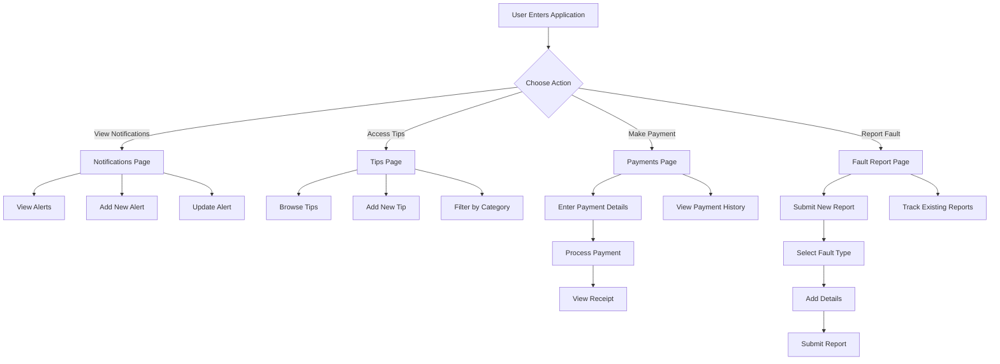
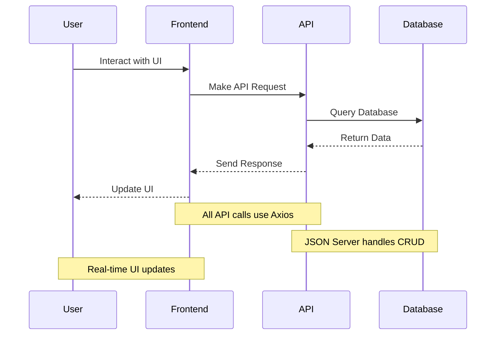
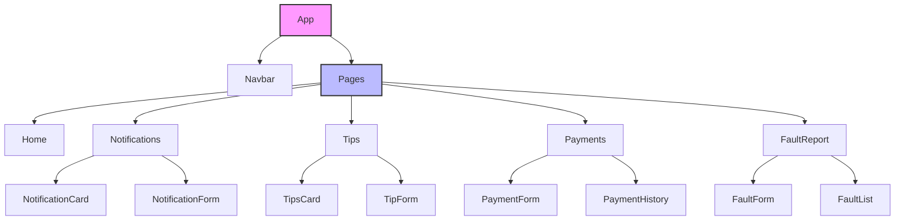

# PowerTrack - Power Utility Management System

## Overview
PowerTrack is a modern web application designed to help users manage and monitor power utility services. It provides real-time notifications about power outages, energy-saving tips, bill payment capabilities, and a fault reporting system. The application is built with React and uses a Node.js/Express backend with a JSON-server database.

## Table of Contents
- [Features](#features)
- [Technology Stack](#technology-stack)
- [Project Structure](#project-structure)
- [Getting Started](#getting-started)
- [API Documentation](#api-documentation)
- [Usage Instructions](#usage-instructions)
- [Limitations](#limitations)
- [Contributing](#contributing)
- [License](#license)

## Features

### 1. Power Outage Notifications
- Real-time alerts about upcoming power cuts
- Severity-based visual indicators
- Area-specific notifications
- Interactive notification management

### 2. Power Saving Tips
- Categorized energy-saving recommendations
- Interactive tip cards
- Category-based filtering
- Tip submission system

### 3. Bill Payments
- Secure payment processing
- Multiple payment methods support
- Transaction history tracking
- Payment status monitoring

### 4. Fault Reporting
- Easy-to-use fault submission system
- Real-time status tracking
- Location-based reporting
- Multiple fault categories

## Technology Stack

### Frontend
- React 18.3.1
- React Router DOM 6.22.2
- Axios for API requests
- TailwindCSS for styling
- React Icons for UI elements

### Backend
- Node.js
- Express.js
- JSON Server for local database
- CORS for cross-origin support

### Development Tools
- Vite for build tooling
- ESLint for code linting
- PostCSS for CSS processing
- Tailwind forms plugin

## Project Structure

+ ```
+ powertrack/
+ ├── public/
+ ├── src/
+ │   ├── components/
+ │   │   ├── FaultForm.jsx          # Fault reporting form component
+ │   │   ├── FaultList.jsx          # List of reported faults
+ │   │   ├── Navbar.jsx             # Navigation bar component
+ │   │   ├── NotificationCard.jsx   # Individual notification display
+ │   │   ├── NotificationForm.jsx   # Notification creation form
+ │   │   ├── PaymentForm.jsx        # Payment processing form
+ │   │   ├── PaymentHistory.jsx     # Transaction history display
+ │   │   ├── TipForm.jsx            # Power saving tip submission form
+ │   │   └── TipsCard.jsx           # Individual tip display
+ │   ├── pages/
+ │   │   ├── FaultReport.jsx        # Fault reporting page
+ │   │   ├── Home.jsx              # Landing page
+ │   │   ├── Notifications.jsx     # Power outage notifications page
+ │   │   ├── Payments.jsx          # Bill payments page
+ │   │   └── Tips.jsx              # Power saving tips page
+ │   ├── services/
+ │   │   └── api.js                # API service configuration
+ │   ├── App.jsx                   # Main application component
+ │   └── index.css                 # Global styles
+ ├── db.json                       # Local JSON database
+ ├── server.js                     # Express server configuration
+ ├── package.json                  # Project dependencies
+ ├── tailwind.config.js           # Tailwind CSS configuration
+ └── postcss.config.js            # PostCSS configuration
+ ```

## Getting Started

### Prerequisites
- Node.js (v14 or higher)
- npm or yarn package manager

### Installation
1. Clone the repository:

```bash
git clone https://github.com/yourusername/powertrack.git
cd powertrack
```

2. Install dependencies:

```bash
npm install
```

3. Start the JSON server:

```bash
npm run json-server
```

4. Start the backend server:

```bash
npm run server
```

5. Start the development server:

```bash
npm run dev
```

## API Documentation

### Users Endpoints
```
GET    /api/users         - Get all users
POST   /api/users         - Create new user
PUT    /api/users/:id     - Update user
DELETE /api/users/:id     - Delete user
```

### Notifications Endpoints
```
GET    /api/notifications         - Get all notifications
POST   /api/notifications         - Create notification
PUT    /api/notifications/:id     - Update notification
DELETE /api/notifications/:id     - Delete notification
```

### Tips Endpoints
```
GET    /api/tips         - Get all tips
POST   /api/tips         - Create tip
PUT    /api/tips/:id     - Update tip
DELETE /api/tips/:id     - Delete tip
```

### Payments Endpoints
```
GET    /api/payments     - Get all payments
POST   /api/payments     - Create payment
```

### Faults Endpoints
```
GET    /api/faults       - Get all faults
POST   /api/faults       - Create fault
PUT    /api/faults/:id   - Update fault
```

## Usage Instructions

### Managing Notifications
1. Navigate to the Notifications page
2. Click "Add Notification" to create new notifications
3. Fill in required details including title, description, area, and timing
4. View and manage existing notifications

### Processing Payments
1. Go to the Payments page
2. Click "Make Payment"
3. Enter payment details
4. Submit payment and view confirmation
5. Track payment history

### Reporting Faults
1. Access the Fault Report page
2. Click "Report Fault"
3. Select fault type and provide details
4. Submit report and track status

## Limitations
1. Uses local JSON server for database (not suitable for production)
2. No authentication system implemented
3. Limited payment gateway integration
4. No real-time updates for notifications
5. Basic error handling
6. No offline support
7. Limited data validation

## Contributing
1. Fork the repository
2. Create a feature branch (`git checkout -b feature/AmazingFeature`)
3. Commit changes (`git commit -m 'Add AmazingFeature'`)
4. Push to branch (`git push origin feature/AmazingFeature`)
5. Open a Pull Request

## License
This project is licensed under the MIT License - see the [LICENSE](LICENSE) file for details.

---

## Contact
Tashinga Duke Chizengwe - tashingachizengwe@gmail.com.com
Project Link: https://github.com/duke4-4/PowerTrack

## Acknowledgments
- React Team
- TailwindCSS Team
- JSON Server Team
- React Icons Team
- Myself

## User Flow Diagram



### Data Flow



### Component Hierarchy

